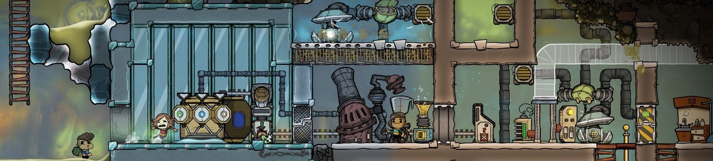
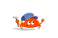

<!--
**esppig/esppig** is a ✨ _special_ ✨ repository because its `README.md` (this file) appears on your GitHub profile. 🌱
-->

<!-- <link href="https://unpkg.com/nes.css@latest/css/nes.min.css" rel="stylesheet" /> -->
<!-- Copyright Nintendo -->
<!-- <section>
    <i class="nes-ash"></i>
    <i class="nes-pokeball"></i>
    <i class="nes-charmander"></i>
    <i class="nes-bulbasaur"></i>
    <i class="nes-squirtle"></i>
</section> -->

<!--  -->
<!--  -->
<!--  -->
<!--  -->

## 👻 &nbsp; WooHoo~

<!-- [url](https://patorjk.com/software/taag/) -->

```md
   ('-.    .-')     _ (`-.    _ (`-.                             (`\ .-') /`                                     
 _(  OO)  ( OO ).  ( (OO  )  ( (OO  )                             `.( OO ),'                                .--, 
(,------.(_)---\_)_.`     \ _.`     \ ,-.-')   ,----.          ,--./  .--.   .-'),-----.  .-'),-----.   .--'  /  
 |  .---'/    _ |(__...--''(__...--'' |  |OO) '  .-./-')       |      |  |  ( OO'  .-.  '( OO'  .-.  ' /  ---`   
 |  |    \  :` `. |  /  | | |  /  | | |  |  \ |  |_( O- )      |  |   |  |, /   |  | |  |/   |  | |  |`--'       
(|  '--.  '..`''.)|  |_.' | |  |_.' | |  |(_/ |  | .--, \      |  |.'.|  |_)\_) |  |\|  |\_) |  |\|  |           
 |  .--' .-._)   \|  .___.' |  .___.',|  |_.'(|  | '. (_/      |         |    \ |  | |  |  \ |  | |  |           
 |  `---.\       /|  |      |  |    (_|  |    |  '--'  |       |   ,'.   |     `'  '-'  '   `'  '-'  '           
 `------' `-----' `--'      `--'      `--'     `------'        '--'   '--'       `-----'      `-----'            
```

<!-- ```md
   ('-.    .-')     _ (`-.    _ (`-.                      
 _(  OO)  ( OO ).  ( (OO  )  ( (OO  )                     
(,------.(_)---\_)_.`     \ _.`     \ ,-.-')   ,----.     
 |  .---'/    _ |(__...--''(__...--'' |  |OO) '  .-./-')  
 |  |    \  :` `. |  /  | | |  /  | | |  |  \ |  |_( O- ) 
(|  '--.  '..`''.)|  |_.' | |  |_.' | |  |(_/ |  | .--, \ 
 |  .--' .-._)   \|  .___.' |  .___.',|  |_.'(|  | '. (_/ 
 |  `---.\       /|  |      |  |    (_|  |    |  '--'  |  
 `------' `-----' `--'      `--'      `--'     `------' 
``` -->

<!-- ```md
   ('-.          .-')            _ (`-.          _ (`-.                                   
 _(  OO)        ( OO ).         ( (OO  )        ( (OO  )                                  
(,------.      (_)---\_)       _.`     \       _.`     \        ,-.-')         ,----.     
 |  .---'      /    _ |       (__...--''      (__...--''        |  |OO)       '  .-./-')  
 |  |          \  :` `.        |  /  | |       |  /  | |        |  |  \       |  |_( O- ) 
(|  '--.        '..`''.)       |  |_.' |       |  |_.' |        |  |(_/       |  | .--, \ 
 |  .--'       .-._)   \       |  .___.'       |  .___.'       ,|  |_.'      (|  | '. (_/ 
 |  `---.      \       /       |  |            |  |           (_|  |          |  '--'  |  
 `------'       `-----'        `--'            `--'             `--'           `------'  
``` -->

## 🍻 &nbsp; Cheers~

<em>

<b> 💡 &nbsp; In imagination, i'm a magician who like to explore new technologies, think about interesting or whimsical questions.</b>

<b> ✨ &nbsp; I'm constantly extract magic from Computer Science, Mathematics and Philosophy.</b>

<!-- <b> 🌀 &nbsp; I'm also a Pokémon Trainer. Chance a Pokémon battle!!~</b> -->

<b> 🎵 &nbsp; I'm still learning Blues Harp & Sky-Studio~</b>

<b> 🚀 &nbsp; Finally, I'm interested in Oxygen-Not-Included. I recommend you try it out~</b>

</em>

<!-- ## 👻 &nbsp; Mix~ -->
<!-- ### 🛠😜 &nbsp; I use it~ -->

<!-- <p align="center">
<code></code>
&nbsp;
<code></code>
&nbsp;
<code></code>
&nbsp;
<code></code>
&nbsp;
<code></code>
&nbsp;
<code></code>
&nbsp;
<code></code>
&nbsp;
<code></code>
&nbsp;
</p> -->

<!-- ## ⚙️ &nbsp; GitHub Analytics

<p align="center">
    


</p> -->

<!-- ## 🤝🏻 &nbsp;Connect -->

<!-- <p align="center">

<a href="https://github.com/esppig">
</a>
<a href="ash-z01@qq.com">
</a>
<a href="E-Meow">
</a>
<a href="https://space.bilibili.com/123004091/">
</a>

</p> -->

<!-- <em>
    <b>You can find how to contact me in the sidebar. </b>
    <b>Let’s find out more interesting things together!</b> 😊
</em> -->

---
⭐️
<!-- ⭐️ from [espurr](https://github.com/esppig)  -->
 <!--  -->
